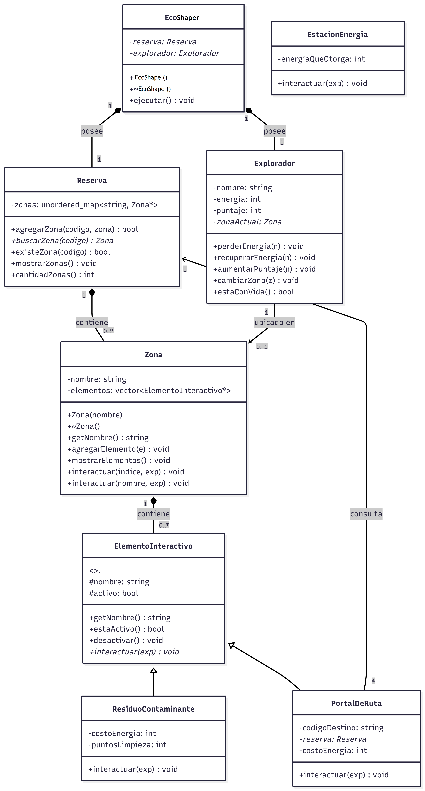
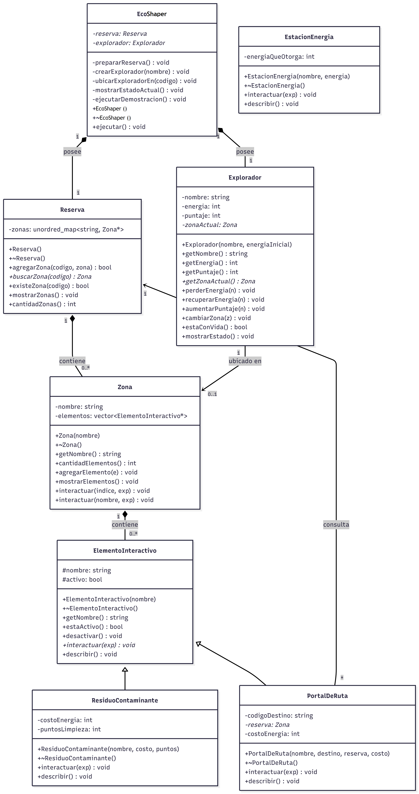

# Diseño del sistema EcoShaper

Este documento contiene la evolución del diseño del sistema, las decisiones tomadas y sus justificaciones.

## Versión inicial del diagrama de clases
Esta versión refleja el diseño tal como fue concebido antes de comenzar a programar. Identifica las clases principales, sus responsabilidades básicas y las relaciones entre ellas.

### Explicación de las relaciones

**Composición** entre EcoShaper-Reserva, EcoShaper-Explorador, Reserva-Zona y Zona-ElementoInteractivo. En cada caso, el objeto contenedor crea y destruye a los objetos contenidos. Si se destruye una `Reserva`, sus zonas mueren con ella; si se destruye una `Zona`, sus elementos también.

**Asociación** entre Explorador-Zona y PortalDeRuta-Reserva. El explorador *conoce* su zona actual pero no la posee, y el portal *consulta* la reserva para resolver su zona destino pero no la administra.

**Herencia** entre ElementoInteractivo y sus tres subclases. Las subclases heredan la interfaz común y deben implementar el método virtual `interactuar`.

### Aplicación de los cuatro pilares de POO

- **Abstracción**: `ElementoInteractivo` define [qué] puede hacer un elemento (interactuar con el explorador) sin especificar [como]. Cada subclase define su propia respuesta.
- **Encapsulamiento**: todos los atributos son privados o protegidos. El estado solo se modifica mediante métodos públicos validados.
- **Herencia**: las tres clases concretas heredan estructura de `ElementoInteractivo`.
- **Polimorfismo**: cuando `Zona::interactuar` invoca `elementos[i]->interactuar(exp)`, el método ejecutado se resuelve en tiempo de ejecución según el tipo real del objeto.

### Caso de sobrecarga

En la clase `Zona` se incluyen dos versiones del método `interactuar`:

- `interactuar(int indice, Explorador* exp)`: para invocar interacción por posición en el vector.
- `interactuar(string nombre, Explorador* exp)`: para invocar interacción por nombre del elemento.

Esta es **sobrecarga** (no sobreescritura): mismo nombre de método, distinta firma, resolución en tiempo de compilación.

## Versión ajustada del diagrama de clases
Esta versión refleja el diseño después de comenzar a programar las primeras clases. Durante la implementación se identificaron necesidades que no estaban en el diseño inicial: validaciones de estado, método para verificar existencia de zonas, y un atributo `activo` para modelar elementos consumibles (estaciones que se gastan, residuos que se eliminan tras limpiarse).

- Se agregó el atributo `activo` y los métodos `estaActivo()` y `desactivar()` en `ElementoInteractivo` para modelar elementos consumibles.
- Se agregó `existeZona()` en `Reserva` como helper que verifica presencia sin retornar el puntero.
- Se agregaron los atributos `puntosLimpieza` en `ResiduoContaminante` y `costoEnergia` en `PortalDeRuta` para parametrizar el comportamiento sin hardcodear valores.
- Se incluyeron multiplicidades explícitas en todas las relaciones.

## Versión final del diagrama de clases
Esta versión refleja exactamente el código entregado, con todos los métodos auxiliares incluidos: getters completos, métodos de visualización, descriptores polimórficos y métodos privados de coordinación en `EcoShaper`.

- Se agregó el método `describir()` polimórfico en `ElementoInteractivo` y todas sus subclases para mostrar información específica del elemento.
- Se agregaron getters completos en `Explorador` (`getEnergia`, `getPuntaje`, `getZonaActual`).
- Se hicieron explícitos los métodos privados auxiliares en `EcoShaper` (`prepararReserva`, `crearExplorador`, etc.) que dividen la lógica del método público `ejecutar()`.
- Se agregaron destructores explícitos en todas las clases derivadas para hacer evidente la cadena de destrucción virtual.

## Matriz de decisiones de diseño
| Decisión | Alternativas consideradas | Decisión final | Justificación | Riesgo si se modela mal |
|---|---|---|---|---|
| Cómo representar las zonas en la Reserva | vector, map, unordered_map | unordered_map | La reserva busca zonas por código (string). unordered_map ofrece búsqueda promedio O(1), mientras que map sería O(log n) y vector sería O(n). No necesitamos orden alfabético. | Búsquedas lentas O(n) o mezcla con lógica de índice numérico que no representa el dominio |
| Relación entre clases contenedoras y contenidas | composición, agregación | Composición en toda la cadena (Reserva-Zona, Zona-Elemento, EcoShaper-Reserva, EcoShaper-Explorador) | Cada objeto contenedor es dueño de los objetos contenidos: los crea con `new` y los destruye en su destructor. Esto simplifica el manejo de memoria y hace explícita la responsabilidad. | Memory leaks si nadie libera la memoria; doble delete si dos objetos se creen dueños del mismo recurso |
| Cómo representar ElementoInteractivo en Zona | vector<Elemento>, vector<Elemento*> | vector<ElementoInteractivo*> | Solo con punteros (o referencias) C++ puede aplicar polimorfismo dinámico. Un vector de objetos haría *object slicing*: solo se almacenarían las partes de la clase base, perdiendo el comportamiento de las subclases. | Se pierde polimorfismo: todos los elementos llamarían el método de la clase base |
| Cómo conecta PortalDeRuta con la Reserva | Pasar la Zona destino, pasar la Reserva | Puntero a Reserva + código destino (string) | Permite resolver la zona destino en runtime y mantiene al portal desacoplado de las zonas concretas. Si la zona destino se reemplaza, el portal sigue funcionando. | Acoplamiento bidireccional si la Reserva también guardara portales; punteros colgantes si la Reserva muere antes |
| Sobrecarga obligatoria en Zona | Por índice numérico, por nombre de elemento, ambas | Ambas: `interactuar(int, Explorador*)` e `interactuar(string, Explorador*)` | Demuestra sobrecarga (resuelta en compile-time) y ofrece dos formas naturales de uso según el contexto: por posición cuando se itera, por nombre cuando se referencia desde la UI o configuración | Confundir sobrecarga con sobreescritura en la sustentación. Ambigüedad si el compilador no puede distinguir entre tipos pasados |
| Clase abstracta vs interfaz pura | Solo virtual puro sin atributos, abstracta con atributos compartidos | Abstracta con atributos protegidos (`nombre`, `activo`) y un método no puro (`describir`) | Todos los elementos comparten estado (nombre, estado activo/inactivo), no solo comportamiento. Una interfaz pura obligaría a duplicar el atributo `nombre` en cada subclase | Duplicación del atributo `nombre` y de su getter en cada subclase si fuera interfaz pura |
| Visibilidad de atributos heredados | private + getters en la base, protected | protected | Las subclases necesitan acceder directamente a `nombre` y `activo` durante sus métodos `interactuar` (por ejemplo, para mostrar mensajes con `nombre` y llamar `desactivar()`). Con private sería más verboso sin ganancia real | Encapsulamiento roto si fuera public; verbosidad innecesaria si fuera private estricto |
| Destructor de ElementoInteractivo | no virtual, virtual | Virtual obligatorio | Sin destructor virtual, hacer `delete elemento` sobre un puntero a la base no llamaría el destructor de la subclase, causando memory leaks si las subclases tuvieran recursos | Memory leaks; comportamiento indefinido al destruir objetos polimórficamente |
| Tamaño del main | Lógica completa en main, delegar a una clase coordinadora | Delegar todo a EcoShaper::ejecutar() | El main es el punto de entrada del sistema operativo, no debe contener lógica de dominio. Separar responsabilidades facilita mantenimiento y testing | Lógica acoplada al main, difícil de reutilizar o probar |
| Gestión de elementos consumibles | Eliminar del vector tras usarse, marcar como inactivo | Marcar como inactivo con atributo `activo` | Eliminar del vector invalidaría índices y haría más compleja la sobrecarga por índice. Marcar como inactivo permite mostrar el historial de elementos usados | Confusión sobre si un elemento existe o no; índices que cambian dinámicamente |